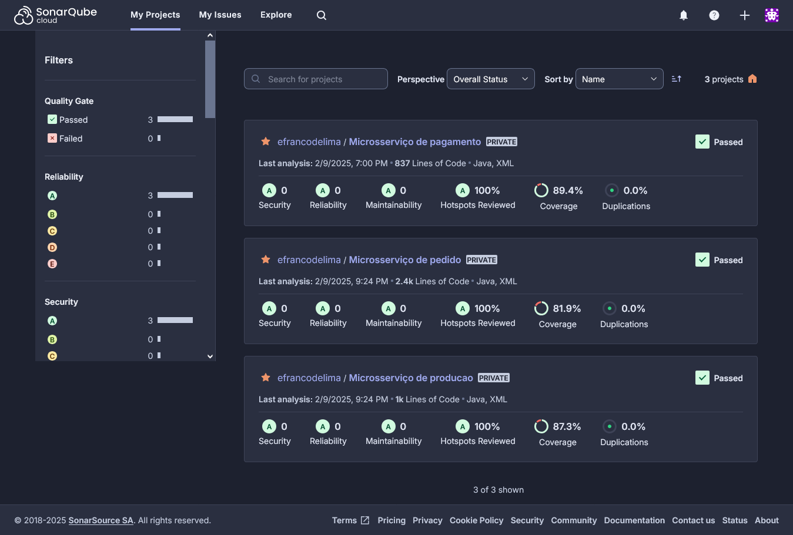

# Tech Challenge - Fase 4

Projeto realizado como atividade avaliativa do curso de **Software Architecture - Pós-Tech - FIAP**.

Link do projeto no GitHub:

- Microsserviço de PEDIDO: https://github.com/efrancodelima/pedido
- Microsserviço de PAGAMENTO: https://github.com/efrancodelima/pagamento
- Microsserviço de PRODUÇÃO: https://github.com/efrancodelima/producao

Link do vídeo demonstrando o projeto em execução:

- https://youtu.be/C-mozV9B57o (funcionamento da aplicação e processo de deploy)
- https://youtu.be/ussy8n-Cozs (atualizações efetuadas na arquitetura)

# Índice

- [Objetivos](#1-objetivos)
- [Requisitos](#2-requisitos)
  - [Arquitetura](#21-arquitetura)
  - [Banco de dados](#22-banco-de-dados)
  - [Testes](#23-testes)
  - [Pipeline](#24-pipeline)
  - [API Web](#25-api-web)
- [Evidências dos testes](#3-evidências-dos-testes)
- [Comentários sobre o projeto](#4-comentários-sobre-o-projeto)
  - [Microsserviços](#41-microsserviços)
  - [Banco de dados](#42-banco-de-dados)
  - [Testes](#43-testes)
  - [Pipeline](#44-pipeline)
- [Instrução para rodar a aplicação](#5-instrução-para-rodar-a-aplicação)

## 1. Objetivos

Desenvolver um sistema para uma lanchonete local em fase de expansão. O sistema deverá realizar o controle dos pedidos, além de outras funções correlatas, conforme especificado no Tech Challenge.

## 2. Requisitos

### 2.1. Arquitetura

O projeto da fase anterior, que utilizava a Clean Architecture, deverá ser migrado para a arquitetura de microsserviços.

O projeto deverá conter, no mínimo, três microsserviços, que deverão se comunicar entre si.

### 2.2. Banco de dados

Cada microsserviço deverá ter seu próprio banco de dados.

Um microsserviço não poderá acessar o banco de dados de outro microsserviço.

Deverá ser utilizado, pelo menos, um banco de dados SQL (relacional) e um NoSQL (não relacional).

### 2.3. Testes

Os microsserviços deverão conter testes de unidade e, pelo menos, um caminho de teste deve implementar o BDD.

Os testes deverão cobrir, no mínimo, 80% do código.

Não foi pedido teste de integração (além do BDD, que geralmente inclui integração, embora não esteja limitado a isso).

### 2.4. Pipeline

Cada microsserviço deverá ter seu próprio repositório no GitHub.

As branchs main deverão estar protegidas de forma a não permitir commits diretos.

Alterações na branch main só serão permitidas via pull request.

A pipeline deverá ser acionada sempre que a branch main for alterada.

A pipeline deverá:
- validar o build;
- validar a qualidade do código via sonarqube ou outro serviço semelhante;
- validar a cobertura de testes, sendo o coverage mínimo de 80%;
- realizar o deploy na nuvem escolhida.

### 2.5. API Web

A seguir, seguem os requisitos quanto à API web definidos no Tech Challenge.

Não houve requisitos novos em relação à fase anterior, mas foi necessário criar alguns endpoints novos para permitir/facilitar a comunicação entre os microsserviços. Então, além dos endpoints mencionados abaixo, que são requisitos do projeto, teremos outros que serão demonstrados no vídeo do projeto.

Cliente

- Cadastrar cliente
- Buscar cliente pelo CPF

Produto:

- Criar, editar e remover produtos
- Buscar produtos por categoria

Pedido

- Fazer checkout
- Deverá retornar a identificação do pedido
- Atualizar o status do pedido
- Consultar o status do pagamento
- Listar pedidos nessa ordem: Pronto > Em Preparação > Recebido
- Pedidos mais antigos primeiro e mais novos depois.
- Pedidos finalizados não devem aparecer na lista.

## 3. Evidências dos testes

Abaixo segue a captura da tela do Sonar Cloud e também deixaremos os links para as pipelines com todos os steps concluídos com sucesso, incluindo os testes, cujos logs são impressos na pipeline.



Links:
- Microsserviço de PEDIDO: https://github.com/efrancodelima/pedido/actions/runs/13273137930/job/37057026528
- Microsserviço de PAGAMENTO: https://github.com/efrancodelima/pagamento/actions/runs/13272650996/job/37055483951
- Microsserviço de PRODUÇÃO: https://github.com/efrancodelima/producao/actions/runs/13231048854/job/36928236519

## 4. Comentários sobre o projeto

Todos os requisitos mencionados nesse documento são atendidos pelo projeto, mas deixaremos aqui alguns comentários sobre as partes que julgamos mais relevantes.

### 4.1. Microsserviços

A aplicação é composta de três microsserviços: pedido, pagamento e produção.

Seguimos mais ou menos a forma de divisão sugerida no Tech Challenge, com pequenas modificações.

O microsserviço de pedido não é a visão do cliente e o microsserviço de produção não é a visão da cozinha.

Em vez de dividirmos os microsserviços por público alvo, preferimos dividi-los por domínios.

Então, embora o microsserviço de produção atenda à cozinha, ele também pode atender o cliente, que deseja saber em que etapa de produção seu pedido está.

Da mesma forma, o microsserviço de pedido, embora atenda ao cliente, que precisa fazer o checkout, também atende à cozinha, que necessita saber o que cada pedido contém para poder produzir.

No divisão por domínios, poderíamos ter um microsserviço só para clientes, outro para produtos e assim por diante. Porém, preferimos adotar uma abordagem mais conservadora na migração do monolito: em vez de realizar uma mudança radical, separamos pequenas partes dele e transformamos em microsserviços.

Sendo assim, o microsserviço de pedidos ainda concentra a parte das funcionalidades da aplicação anterior, exceto no que diz respeito ao pagamento e à esteira de produção (o histórico dos pedidos).

### 4.2. Banco de dados

O microsserviço de pagamento utiliza o banco de dados MongoDB, que é orientado a documentos.

Escolhi esse microsserviço para utilizar o banco não relacional, pois ele recebe notificações do mercado livre e, em algum momento futuro, o formato da notificação pode mudar ou a aplicação pode decidir alterar quais campos dessa notificação é importante guardar em seu banco de dados.

Nessa situação, o fato do MogoDB ter uma estrutura flexível em vez de um esquema rígido pode ser uma vantagem.

Os outros microsserviços (pedido e produção) utilizam banco de dados relacionais.

### 4.4. Testes

Os testes de unidade sozinhos já atingem cobertura de código superior a 80%, tanto na cobertura de linhas de código quanto na cobertura de ramificações do código.

Além deles, criamos 3 testes BDD no microsserviço de pedido, 2 no de pagamento e 2 no de produção (número superior ao mínimo, que era 1 em cada). Criamos um a mais no de pedido, pois é o microsserviço que contém mais funcionalidades, então pareceu razoável que ele tivesse mais testes também.

### 4.4. Pipeline

As mudanças em relação à fase anterior foram os testes e o Sonar.

Os testes BDD necessitam da aplicação rodando para funcionar, então temos novos steps para:
- iniciar a aplicação com o profile de testes (comando maven);
- aguardar a disponibilidade da aplicação (script bash);
- enviar o código para análise do Sonar Cloud;
- verificar a qualidade do código e a cobertura de testes.

No microsserviço de pagamento temos um step a mais que é o service do MongoDB. Embora o uso de bancos de dados do tipo embedded (como o H2) seja amplamente difundido, há uma discussão na comunidade a respeito do assunto: um teste de integração de verdade não deveria usar um banco de dados de verdade?

Note que as versões do Mongo embedded disponíveis no mercado não são oferecidas pela mesma equipe que oferece a versão ofocial do MongoDB. Por esse motivo, prefirimos utilizar um banco de dados real nos testes em vez de um banco embedded. Poderíamos ter feito isso nos outros microsserviços também? Sim, mas como esses já estavam funcionando, por ora, deixamos como estão.

Para análise do código, utilizamos o Sonar Cloud. Essa ferramenta realmente executa os testes, em vez de apenas utilizar os relatórios gerados pelo jacoco. No log do step do Sonar, podemos verificar os testes sendo executados. Sendo assim, removi o step que tinha na fase anterior com o comando "mvn test". A ideia é tornar a pipeline mais enxuta e eficiente.

A análise da qualidade do código é feita com um script bash que pega os dados do Sonar Cloud (utilizando a API Web que ele disponibiliza) e verifica se os valores estão ok.

O script confere e imprime os dados, item por item, no log da pipeline:
- coverage analysis (tests errors, testes failures, coverage and line coverage);
- security analysis (vulnerabilities, hotspots and rating);
- reliability analysis (bugs and rating);
- maintainability analysis (code smells and rating);
- quality gate (status).

O restante da pipeline não mudou muita coisa. Só o build da imagem, que teve o arquivo dockerfile modificado um pouco: antes os dados de conexão com o banco eram definidos no build, passados como variáveis de ambiente; agora essa parte foi removida e os as variáveis são definidas nas task definitions do ECS.

Resumindo: os dados continuam sendo passados como variáveis de ambiente, só que agora o valor das variáveis é definido após o build, não durante. Isso dá mais flexibilidade ao código, já que não precisamos realizar um novo build caso alguma dessas variáveis mude. Além dos dados de conexão com o banco, as URLs dos microsserviços também são variáveis de ambiente definidas após o build. 

## 5. Instrução para rodar a aplicação

Primeiro, é necessário verificar se os bancos de dados estão ativos e, depois, realizar o deploy dos microsserviços.

Sugestão de ordem para execução das APIs:

- Cadastrar cliente
- Buscar cliente pelo CPF
- Cadastrar produtos
- Editar produto
- Buscar produtos por categoria
- Remover produtos (não remova todos, deixe pelo menos 1)
- Fazer checkout
- Consultar o status do pagamento
- Mock da notificação do Mercado Pago \*
- Atualizar o status do pedido
- Listar pedidos

O status do pedido muda em uma ordem definida: recebido, em preparação, pronto, finalizado. Mas ele não avança se o pedido não tiver o pagamento aprovado, então é necessário realizar o mock da notificação do Mercado Pago antes de atualizar o status do pedido.

Exemplo de mock para a notificação do Mercado Pago usando o curl (você pode usar o Postman também, se preferir).

```
curl -X PUT <URL>/api/v2/pedidos/webhook/ \
-H "Content-Type: application/json" \
-d '{
"id": 1,
"date_created": "2024-09-30T11:26:38.000Z",
"date_approved": "2024-09-30T11:26:38.000Z",
"date_last_updated": "2024-09-30T11:26:38.000Z",
"money_release_date": "2017-09-30T11:22:14.000Z",
"payment_method_id": "Pix",
"payment_type_id": "credit_card",
"status": "approved",
"status_detail": "accredited",
"currency_id": "BRL",
"description": "Pago Pizza",
"collector_id": 2,
"payer": {
  "id": 123,
  "email": "test_user_80507629@testuser.com",
  "identification": {
	"type": "CPF",
	"number": 19119119100
  },
  "type": "customer"
},
"metadata": {},
"additional_info": {},
"external_reference": "MP0001",
"transaction_amount": 250,
"transaction_amount_refunded": 50,
"coupon_amount": 15,
"transaction_details": {
  "net_received_amount": 250,
  "total_paid_amount": 250,
  "overpaid_amount": 0,
  "installment_amount": 250
},
"installments": 1,
"card": {}
}'
```
